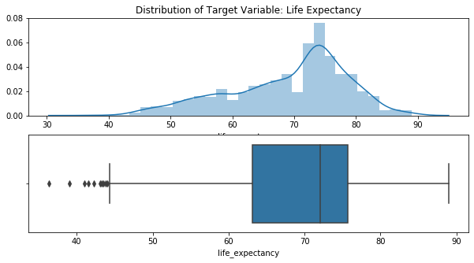
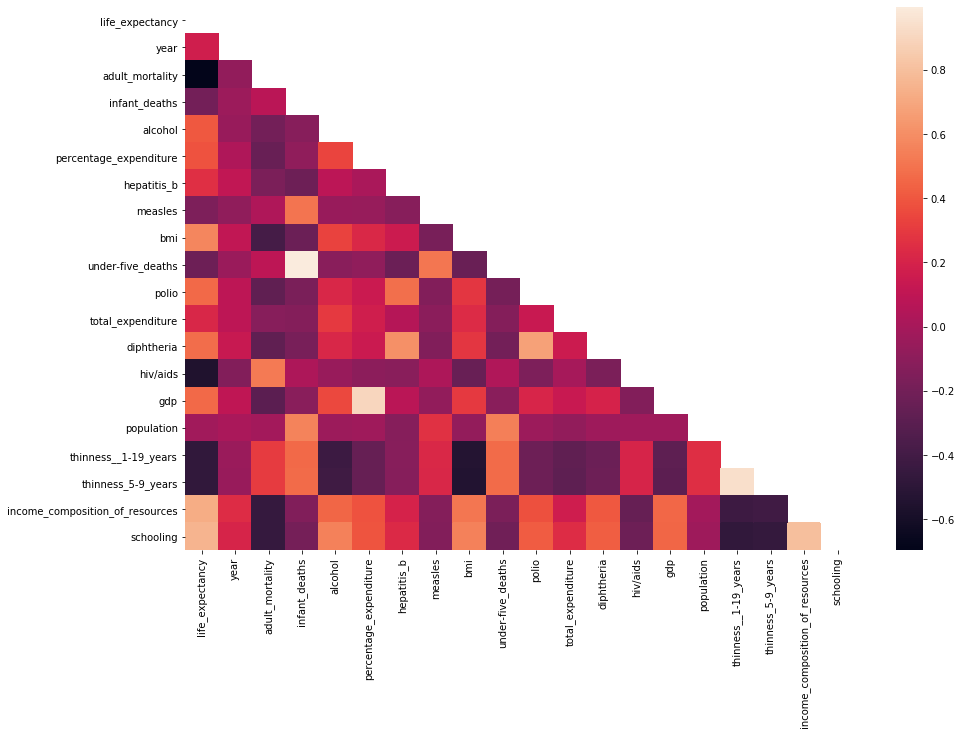
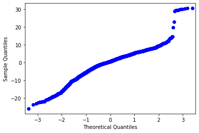
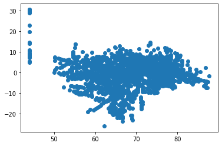
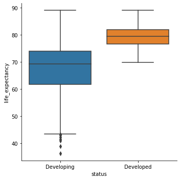
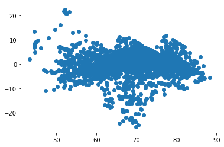

For this exercise we will work through the different steps of a linear regression workflow.  We will:

### 1. FSM
- Load in the dataset: inspect the overall shape, duplicate entries, and na's.
- Identify the continuous target variable
- Perform Initial EDA: correlation plots
- Build a FSM (First Simple Model) with statsmodels/Build a FSM with sklearn
- Check the assumptions of linear regression  

### 2. Iterate: Build a better model - Add another numerical feature
- Add another feature, this time with high negative correlation, and fit the model
- Compare metrics and interpret coefficients
- Check the assumptions

### 3. Iterate: Build a better model - Add a categorical feature
- Add a categorical variable 
- Compare metrics and interpret coefficients
- Check the assumptions once-again

### 4. Appendix
- Next steps

## The Dataset
We will use a dataset from [Kaggle](https://www.kaggle.com/kumarajarshi/life-expectancy-who). It contains data collected by the WHO about life expectancy and potentially-related factors.  The information is aggregated on a per-country per-year basis.

The following questions have been posed. Read them and keep them in your mind when building your model.  We will reference them as we proceed through the workflow.

1. Do various predicting factors which have been chosen initially really affect life expectancy? Which predicting variables actually affect life expectancy?
2. Should a country having a lower life expectancy value(<65) increase its healthcare expenditure in order to improve its average lifespan?
3. How do infant and adult mortality rates affect life expectancy?
4. Does life expectancy have positive or negative correlation with eating habits, lifestyle, exercise, smoking, drinking alcohol etc.
5. What is the impact of schooling on the lifespan of humans?
6. Does Life expectancy have positive or negative relationship with drinking alcohol?
7. Do densely populated countries tend to have lower life expectancy?
8. What is the impact of immunization coverage on life Expectancy?

# 1. FSM

### Load in the dataset and check the overall shape


```python
# 0. Load in the dataset and check the overall shape

# load in the dataset
df = pd.read_csv('data/life_expectancy.csv')

# How many records are in the data set?
records = df.shape[0]

# How many columns are in the dataset?
columns = len(df.columns)

# Check for duplicate entries
df.duplicated().sum()

# Check for na's (just look to get an idea; don't drop or impute yet)
df.isna().sum()

```


    Country                              0
    Year                                 0
    Status                               0
    Life expectancy                     10
    Adult Mortality                     10
    infant deaths                        0
    Alcohol                            194
    percentage expenditure               0
    Hepatitis B                        553
    Measles                              0
     BMI                                34
    under-five deaths                    0
    Polio                               19
    Total expenditure                  226
    Diphtheria                          19
     HIV/AIDS                            0
    GDP                                448
    Population                         652
     thinness  1-19 years               34
     thinness 5-9 years                 34
    Income composition of resources    167
    Schooling                          163
    dtype: int64


### What does a row in the dataframe represent?


```python
"""
Each row represents a *year* of a *country's* health data.
"""
```


    "\nEach row represents a *year* of a *country's* health data.\n"


### Identify the continous target variable


```python
# Identify the continuous target variable of interest
df['Life expectancy ']


```


    0       65.0
    1       59.9
    2       59.9
    3       59.5
    4       59.2
            ... 
    2933    44.3
    2934    44.5
    2935    44.8
    2936    45.3
    2937    46.0
    Name: Life expectancy , Length: 2938, dtype: float64


If you had problems isolating that variable, don't worry.  That is on purpose! 
There can be odd, burdensome inconsistencies in naming of data.
Let's use our Python skills to wipe out the naming inconsistencies.

### Clean up the column names. 
There are many ways to do this. One way of doing so, outlined below, uses the columns attribute of the dataframe.  Then, using a list comprehension or for loop, we can manipulate the column name strings using methods that come with the string class.


```python
# Lastly, to make things easier to interpet, set the target to column index 0

cols = list(df.columns)
cols = [cols[3]] + cols[:3] + cols[4:]
df = df[cols]

```


```python

# 1. Gather column names into a variable
columns = df.columns

# 2. Strip whitespace from the ends
columns = [column.strip() for column in columns]

# 3. Replace white space with underscores
columns = [column.replace(' ', '_') for column in columns]

# 4. Make all columns characters lowercase
columns = [column.lower() for column in columns]

# 5. Reset the column names of the dataframe
df.columns = columns
```


```python
# Revisit the continuous target variable.  
# Explore it a bit.  Plot it's distribution and boxplot

fig, ax = plt.subplots(2,1, figsize=(10,5))
sns.distplot(df.life_expectancy, ax = ax[0])
sns.boxplot(df.life_expectancy, ax= ax[1])

ax[0].set_title('Distribution of Target Variable: Life Expectancy');
```





## Perform Initial EDA

There are a lot of variables here!  Let's look at a correlation matrix to see which ones might be the most useful.  (Here we are looking for variables that are highly correlated with the target variable, but not highly correlated with other input variables)


```python
# create a correlation matrix
# first, just use the datafram .corr() method to output a numerical matrix
df.corr()

# Then pass the above code into Seaborn's heatmap plot
mask = np.triu(np.ones_like(df.corr(), dtype=np.bool))

fig, ax = plt.subplots(figsize=(15,10))
sns.heatmap(df.corr(), mask=mask)
```


    <matplotlib.axes._subplots.AxesSubplot at 0x1a2d158c18>





```python
# From the heatmap, which features have high correlation? 
"Schooling, income_composition_of_resources, BMI"
```


    'Schooling, income_'


Use seaborn's pairplot function on the three features above plus life_expectancy.  
Note: we would usually start right off by using a pairplot, but because we have so many features, the pairplot would be unwieldy.


```python
high_correlation_df = df[['life_expectancy', 'schooling', 
                         'income_composition_of_resources', 'bmi']]

sns.pairplot(high_correlation_df)
```


    <seaborn.axisgrid.PairGrid at 0x1a2d1727b8>


Judging from the top row of the pairplot, one feature's correlation to the target is a bit fuzzier than the rest. 
Inspecting other cells of the pairplot, the other two features show covariance. 
Given those two insights, choose one feature to build the First Simple Model with.
Consider also whether choosing one of the positively correlated features above the others would help answer any of the question listed at the beginning of the notebook.


```python

"""
It looks like the correlation with BMI is a little fuzzier than the others, 
so let's exclude it for now.  
`Schooling` and `Income_Composition_of_Resources` are highly correlated with both life expectancy and each other, 
so let's only include one of them. 
`Schooling` seems like a good choice because it would allow us to answer Question 5.
"""

```


    "\nIt looks like the correlation with BMI is a little fuzzier than the others, \nso let's exclude it for now.  \n`Schooling` and `Income_Composition_of_Resources` are highly correlated with both life expectancy and each other, \nso let's only include one of them. \n`Schooling` seems like a good choice because it would allow us to answer Question 5.\n"


## FSM with Statsmodels


```python
from statsmodels.formula.api import ols
# Create a dataframe with only the target and the chosen high-positive corellation feature

fsm_df = df[["schooling", "life_expectancy"]].copy()
fsm_df.dropna(inplace=True)

# build the R-style formula. The format is "target~feature_1 + feature_2 + feature_3"

formula = "life_expectancy ~ schooling"

# Fit the model on the dataframe composed of the two features

fsm = ols(formula=formula, data=fsm_df).fit()
```


```python
# The object also has attributes associated with the ouput, such as: rsquared, and params.
# save those values to the variables below.

rsquared = fsm.rsquared
params = fsm.params

print(f'Rsquared of FSM: {rsquared}')
print('----------')
print('Beta values of FSM:')
print(params)
              
```

    Rsquared of FSM: 0.565467096558071
    ----------
    Beta values of FSM:
    Intercept    44.108889
    schooling     2.103453
    dtype: float64


Interpret the result of the FSM.  What does the R Squared tell you? Remember the formula for:

$\Large R^2 = 1 - \frac{SSE}{SST}$

Also, interepret the coefficients.  If we increase the value of our independent variable by 1, what does it mean for our predicted value?

What is will our model predict the value of Life Expectancy to be for a country with 0 years of school on average?


```python
'''
Not too bad.  We are only explaining about 57% of the variance in life expectancy, but we only have one feature so far and it's statistically significant at an alpha of 0.05.

We could stop right now and say that according to our model:

 - A country with zero years of schooling on average is expected to have a life expectancy of 44.1 years
 - For each additional average year of schooling, we expect life expectancy to increase by 2.1 years
 
'''
```


    "\nNot too bad.  We are only explaining about 57% of the variance in life expectancy, but we only have one feature so far and it's statistically significant at an alpha of 0.05.\n\nWe could stop right now and say that according to our model:\n\n - A country with zero years of schooling on average is expected to have a life expectancy of 44.1 years\n - For each additional average year of schooling, we expect life expectancy to increase by 2.1 years\n \n"


# Check the assumptions of Linear Regression

#### 1. Linearity

Linear regression assumes that the input variable linearly predicts the output variable.  We already qualitatively checked that with a scatter plot.  But I also think it's a good idea to use a statistical test.  This one is the [Rainbow test](https://www.tandfonline.com/doi/abs/10.1080/03610928208828423) which is available from the [diagnostic submodule of StatsModels](https://www.statsmodels.org/stable/generated/statsmodels.stats.diagnostic.linear_rainbow.html#statsmodels.stats.diagnostic.linear_rainbow)

The null hypothesis is that the model is linearly predicted by the features, alternative hypothesis is that it is not.  Thus returning a low p-value means that the current model violates the linearity assumption.

#### 2. Normality

Linear regression assumes that the residuals are normally distributed.  It is possible to check this qualitatively with a Q-Q plot.  The fit model object has an attribute called resid, which is an array of the difference between predicted and real values.  Store the residuals in the variable below, show the qq plot, and interepret. You are looking for the theoretical quantiles and the sample quantiles to line up.


```python
# Create a qq-plot

fsm_resids = fsm.resid

import statsmodels.api as sm
sm.qqplot(fsm_resids)
```





Those qqplots don't look so good in the upper right corner.

The [Jarque-Bera](https://en.wikipedia.org/wiki/Jarque%E2%80%93Bera_test) test is performed automatically as part of the model summary output, labeled **Jarque-Bera (JB)** and **Prob(JB)**.

The null hypothesis is that the residuals are normally distributed, alternative hypothesis is that they are not.  
What does the JB score output indicate. Does it support the qq-plot?


```python
'''The JB score has a low p-value means that the current model violates the normality assumption. 
That supports the qq visual with the crooked tail.'''
```


    'The JB score has a low p-value means that the current model violates the normality assumption. \nThat supports the qq visual with the crooked tail.'


#### 3. Homoscadasticity

Linear regression assumes that the variance of the dependent variable is homogeneous across different value of the independent variable(s).  We can visualize this by looking at the predicted life expectancy vs. the residuals.


Interepret the result. Do you see any patterns that suggest that the residuals exhibit heteroscedasticity?


```python

y_hat = fsm.predict()

fig, ax = plt.subplots()

ax.scatter(y_hat, fsm_resids)
```


    <matplotlib.collections.PathCollection at 0x1a2fa33908>





```python
'''
Just visually inspecting this, it seems like our model over-predicts life expectancy 
between 60 and 70 years old in a way that doesn't happen for other age groups.  
Plus we have some weird-looking data in the lower end that we might want to inspect.  
Maybe there was something wrong with recording those values, 
or maybe there is something we can feature engineer once we have more independent variables.
'''
```


    "\nJust visually inspecting this, it seems like our model over-predicts life expectancy \nbetween 60 and 70 years old in a way that doesn't happen for other age groups.  \nPlus we have some weird-looking data in the lower end that we might want to inspect.  \nMaybe there was something wrong with recording those values, \nor maybe there is something we can feature engineer once we have more independent variables.\n"


Let's also run a statistical test.  The [Breusch-Pagan test](https://en.wikipedia.org/wiki/Breusch%E2%80%93Pagan_test) is available from the [diagnostic submodule of StatsModels](https://www.statsmodels.org/stable/generated/statsmodels.stats.diagnostic.het_breuschpagan.html#statsmodels.stats.diagnostic.het_breuschpagan)

The null hypothesis is homoscedasticity, alternative hypothesis is heteroscedasticity.  
What does the p-value returned above indicate?


```python
'''Thus returning a low p-value means that the current 
model violates the homoscedasticity assumption'''

```


    'Thus returning a low p-value means that the current \nmodel violates the homoscedasticity assumption'


#### 4. Independence

The independence assumption means that the independent variables must not be too collinear.  Right now we have only one independent variable, so we don't need to check this yet.

## Train a model with sklearn
The sklearn interface is simpler than Statsmodels, but it does not give us the super helpful statsmodel output.  We will, however, use its syntax consistently with other algorithms.  


```python
from sklearn.linear_model import LinearRegression

# fit an sklearn model
#instantiate a linear regression object 
lr = LinearRegression()

# split the data into target and features
y = fsm_df.life_expectancy
X = fsm_df.drop('life_expectancy', axis=1)

# Call .fit from the linear regression object, and feed X and y in as parameters
lr.fit(X,y)

# lr has a method called score.  Again, feed in X and y, and read the output. Save it in the variable score.  What is that number?  Compare it to statsmodels. 
score = lr.score(X,y)
# that is the r_2.  It is the same as the Statsmodels R_2

# lr also has attributes coef_ and intercept_. Save and compare to statsmodels
beta = lr.coef_
intercept = lr.intercept_
#sklearn calculates the same coeficients and intercepts as statmodels.

```

# 2. Iterate: Build a better model - Add another numerical feature

## Adding Features to the Model

So far, all we have is a simple linear regression.  Let's start adding features to make it a multiple regression.

Let's repeat the process of the highly positively correlated variables, but this time with the highly negatively correlated variables (based on looking at the correlation matrix)

`adult_mortality` seems most like a linear relationship.  Also, the two thinness metrics seem to be providing very similar information, so we almost certainly should not include both

Let's proceed with adult mortality.


```python

# Create another dataframe containing our three features of interest
model_2_df = df[['life_expectancy', 'schooling', 'adult_mortality']].copy()

# Drop na's across all columns
model_2_df.dropna(inplace=True)

# save the R-like formula into the variable
formula = 'life_expectancy~schooling+adult_mortality'

# train the model like we did above
model_2 = ols(formula=formula, data=model_2_df).fit()

# print out the summary
model_2.summary()

```


<table class="simpletable">
<caption>OLS Regression Results</caption>
<tr>
  <th>Dep. Variable:</th>     <td>life_expectancy</td> <th>  R-squared:         </th> <td>   0.714</td> 
</tr>
<tr>
  <th>Model:</th>                   <td>OLS</td>       <th>  Adj. R-squared:    </th> <td>   0.713</td> 
</tr>
<tr>
  <th>Method:</th>             <td>Least Squares</td>  <th>  F-statistic:       </th> <td>   3443.</td> 
</tr>
<tr>
  <th>Date:</th>             <td>Wed, 10 Jun 2020</td> <th>  Prob (F-statistic):</th>  <td>  0.00</td>  
</tr>
<tr>
  <th>Time:</th>                 <td>21:27:54</td>     <th>  Log-Likelihood:    </th> <td> -8387.7</td> 
</tr>
<tr>
  <th>No. Observations:</th>      <td>  2768</td>      <th>  AIC:               </th> <td>1.678e+04</td>
</tr>
<tr>
  <th>Df Residuals:</th>          <td>  2765</td>      <th>  BIC:               </th> <td>1.680e+04</td>
</tr>
<tr>
  <th>Df Model:</th>              <td>     2</td>      <th>                     </th>     <td> </td>    
</tr>
<tr>
  <th>Covariance Type:</th>      <td>nonrobust</td>    <th>                     </th>     <td> </td>    
</tr>
</table>
<table class="simpletable">
<tr>
         <td></td>            <th>coef</th>     <th>std err</th>      <th>t</th>      <th>P>|t|</th>  <th>[0.025</th>    <th>0.975]</th>  
</tr>
<tr>
  <th>Intercept</th>       <td>   56.0636</td> <td>    0.475</td> <td>  117.981</td> <td> 0.000</td> <td>   55.132</td> <td>   56.995</td>
</tr>
<tr>
  <th>schooling</th>       <td>    1.5541</td> <td>    0.032</td> <td>   48.616</td> <td> 0.000</td> <td>    1.491</td> <td>    1.617</td>
</tr>
<tr>
  <th>adult_mortality</th> <td>   -0.0329</td> <td>    0.001</td> <td>  -37.803</td> <td> 0.000</td> <td>   -0.035</td> <td>   -0.031</td>
</tr>
</table>
<table class="simpletable">
<tr>
  <th>Omnibus:</th>       <td>537.142</td> <th>  Durbin-Watson:     </th> <td>   0.685</td>
</tr>
<tr>
  <th>Prob(Omnibus):</th> <td> 0.000</td>  <th>  Jarque-Bera (JB):  </th> <td>2901.045</td>
</tr>
<tr>
  <th>Skew:</th>          <td>-0.813</td>  <th>  Prob(JB):          </th> <td>    0.00</td>
</tr>
<tr>
  <th>Kurtosis:</th>      <td> 7.745</td>  <th>  Cond. No.          </th> <td>1.02e+03</td>
</tr>
</table><br/><br/>Warnings:<br/>[1] Standard Errors assume that the covariance matrix of the errors is correctly specified.<br/>[2] The condition number is large, 1.02e+03. This might indicate that there are<br/>strong multicollinearity or other numerical problems.


### Did the r_2 improve? 
Your answer here


```python
'Adding another feature improved the r-squared from 0.565 to 0.714'
```


    'Adding another feature improved the r-squared from 0.565 to 0.714'


```python
rainbow_statistic, rainbow_p_value = linear_rainbow(model_2)
print("Rainbow statistic:", rainbow_statistic)
print("Rainbow p-value:", rainbow_p_value)

'Assuming an alpha of 0.05, we are no longer violating the linearity assumption (just barely)'
```

    Rainbow statistic: 1.0919639546889197
    Rainbow p-value: 0.05102555171520744


    'Assuming an alpha of 0.05, we are no longer violating the linearity assumption (just barely)'


```python
'The Jarque-Bera (JB) output has gotten worse. We are still violating the normality assumption.''
```


      File "<ipython-input-381-b763d8b6629b>", line 2
        'The Jarque-Bera (JB) output has gotten worse. We are still violating the normality assumption.''
                                                                                                         ^
    SyntaxError: EOL while scanning string literal


## Independence

You might have noticed in the regression output that there was a warning about the condition number being high. The condition number is a measure of stability of the matrix used for computing the regression (we'll discuss this more in the next module), and a number above 30 can indicate strong multicollinearity. Our output is way higher than that.

A different (more generous) measure of multicollinearity is the variance inflation factor. It is available from the outlier influence submodule of StatsModels.

Run the code below:

A "rule of thumb" for VIF is that 5 is too high.  Given the output above, it's reasonable to say that we are not violating the independence assumption, despite the high condition number.

### 3. Iterate: Build a better model - Add a categorical feature


This is less realistic than the previous steps, but is good for demonstartion purposes.

In this dataset, we have a lot of numeric values (everything in that correlation matrix), but there are a few that aren't.  One example is `Status`


```python

# Create a dataframe with the "life_expectancy", "schooling", "adult_mortality", "status"] columns
model_3_df = df[["life_expectancy", "schooling", "adult_mortality", "status"]].copy()

# Drop NA's
model_3_df.dropna(inplace=True)

# Inspect value counts  of the status column
model_3_df["status"].value_counts()


```


    Developing    2304
    Developed      464
    Name: status, dtype: int64


```python
# Plot status vs life expectancy.  Choose a kind of plot to pass into the kind parameter
sns.catplot(x="status", y="life_expectancy", data=model_3_df, kind='box')
```


    <seaborn.axisgrid.FacetGrid at 0x1a2e2887f0>





It looks like there is a difference between the two groups that might be useful to include

There are only two categories, so we only need a `LabelEncoder` that will convert the labels into 1s and 0s.  If there were more than two categories, we would use a `OneHotEncoder`, which would create multiple columns out of a single column.


```python
from sklearn.preprocessing import LabelEncoder

# instantiate and instance of LabelEncoder
label_encoder = LabelEncoder()

# Pass the "status" column of the model_3_df to the fit_transform() method of the Label Encoder
status_labels = label_encoder.fit_transform(model_3_df["status"])

```

This is telling us that "Developed" is encoded as 0 and "Developing" is encoded as 1.  This means that "Developed" is assumed at the intercept.


```python
# Add the status labels array to the model_df as a column 
model_3_df["status_encoded"] = status_labels
model_3_df.drop("status", axis=1, inplace=True)
```

### Third Model Evaluation
 Your answer here


```python
# Did the R_squared improve
"Adding another feature improved the r-squared a tiny bit from 0.714 to 0.718"
```

#### Linearity

#### Normality
Did our errors become more normally distributed?

Your answer here


```python
#### Normality

'''
The **Jarque-Bera (JB)** output has gotten slightly better.  
But we are still violating the normality assumption.
'''


```


    '\nThe **Jarque-Bera (JB)** output has gotten slightly better.  \nBut we are still violating the normality assumption.\n'


#### Homoscadasticity

Did our homoscadasticity improve?


```python


model_3_resids = model_3.resid
y_hat = model_3.predict()

fig, ax = plt.subplots()

ax.scatter(y_hat, model_3_resids)
```


    <matplotlib.collections.PathCollection at 0x1a308ee1d0>





```python
lm, lm_p_value, fvalue, f_p_value = het_breuschpagan(y-y_hat, model_3_df[["schooling", "adult_mortality", "status_encoded"]])
print("Lagrange Multiplier p-value:", lm_p_value)
print("F-statistic p-value:", f_p_value)
```

    Lagrange Multiplier p-value: 6.82832277846069e-89
    F-statistic p-value: 9.27409337812992e-95


```python
'''This metric got worse, although the plot looks fairly similar'''
```


    'This metric got worse, although the plot looks fairly similar'


#### Independence

What does the above output tell you?

Your answer here


```python
"""The VIF metrics are getting higher, which means that there is stronger multicollinearity.  
But we have still not exceeded the threshold of 5."""
```


    'The VIF metrics are getting higher, which means that there is stronger multicollinearity.  \nBut we have still not exceeded the threshold of 5.'


Below, you will find an example summary of how one might use the linear regression models shown above to address the questions posed at the beginning of the notebook.

# Summary
We started with a baseline model where the only input feature was Schooling. Our baseline model had an r-squared of 0.565. This model violated the linearity (p < 0.001), normality (p < 0.001), and homoscadasticity (p < 0.001) assumptions of linear regression. The independence assumption was met by default because there was only one input feature.

The final model for this lesson had three input features: Schooling, Adult_Mortality, and Status_Encoded. It had an r-squared of 0.718. This model did not violate the linearity assumption (p = 0.084), but it did violate the normality (p < 0.001) and homoscedasticity (p < 0.001) assumptions. Based on the variance inflaction factor metric, it did not violate the independence assumption.

We are able to address the following questions from above:

1. Does various predicting factors which has been chosen initially really affect the Life expectancy? What are the predicting variables actually affecting the life expectancy?

With only 3 features we are able to explain about 71% of the variance in life expectancy. This indicates that these factors truly are explanatory. More analysis is required to understand how much additional explanatory power would be provided by incorporating additional features into the model.

3. How do Infant and Adult mortality rates affect life expectancy?

So far we have only investigated adult mortality. The adult mortality rate ("probability of dying between 15 and 60 years per 1000 population") has a negative correlation with life expectancy. For each increase of 1 in the adult mortality rate, life expectancy decreases by about .03 years.

5. What is the impact of schooling on the lifespan of humans?

In our latest model, we find that each additional year of average schooling is associated with 1.4 years of added life expectancy. However it is challenging to interpret whether it is schooling that is actually having the impact. Schooling is highly correlated with Income_Composition_of_Resources ("Human Development Index in terms of income composition of resources") so it is very possible that schooling is the result of some underlying factor that also impacts life expectancy, rather than schooling impacting life expectancy directly.

### 4. Further exercises

# Appendix
Things we have not done in this lesson, but that you should consider in your project:  

More robust cleaning (possible imputation of missing values, principled exclusion of some data)  
Feature scaling  
Nearest-neighbors approach (requires more complex feature engineering)  
Pulling information from external resources  
Removing independent variables if you determine that they are causing too high of multicollinearity  
Setting up functions so the code is not so repetitive  
