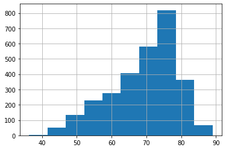

```python
import pandas as pd
import numpy as np
import matplotlib.pyplot as plt
import seaborn as sns

pd.set_option('display.max_columns', None)
```

For this exercise we will work through the different steps of a linear regression workflow.  We will:

### FSM
1. Load in the dataset: inspect the overall shape, duplicate entries, and na's.
2. Identify the continuous target variable
3. Perform Initial EDA: correlation plots
4. Build a FSM (First Simple Model) with statsmodels/Build a FSM with sklearn
5. Check the assumptions of linear regression  

### Iterate: Build a better model
6. Identify independent variables, and differentiate between numerical vs categorical features
7. Identify and remove outliers  
8. Check for duplicate entries and nas
9. Scale continuous features  
10. Add more continuous features refit, compare R2, check assumptions  

### Iterate: Build a better model
10. Encode categorical variables
11. Add a categorical variable to the model, refit compare R2, check assumptions


## The Dataset
We will use a dataset from [Kaggle](https://www.kaggle.com/kumarajarshi/life-expectancy-who). It contains data collected by the WHO about life expectancy and potentially-related factors.  The information is aggregated on a per-country per-year basis.

The following questions have been posed. Read them and keep them in your mind when building your model.  We will reference them as we proceed through the workflow.

1. Do various predicting factors which have been chosen initially really affect life expectancy? Which predicting variables actually affect life expectancy?
2. Should a country having a lower life expectancy value(<65) increase its healthcare expenditure in order to improve its average lifespan?
3. How do infant and adult mortality rates affect life expectancy?
4. Does life expectancy have positive or negative correlation with eating habits, lifestyle, exercise, smoking, drinking alcohol etc.
5. What is the impact of schooling on the lifespan of humans?
6. Does Life expectancy have positive or negative relationship with drinking alcohol?
7. Do densely populated countries tend to have lower life expectancy?
8. What is the impact of immunization coverage on life Expectancy?

### 1. Load in the dataset and check the overall shape


```python
# load in the dataset
df = None

# How many records are in the data set?
records = None

# How many columns are in the dataset?
columns = None

# Check for duplicate entries

# Check for na's (just look to get an idea; don't drop or impute yet)

```

### 3. What does a row in the dataframe represent?


```python
# Your answer here
```

### 2: Identify the continous target variable

If you had problems isolating that variable, don't worry.  That is on purpose! 
There can be odd, burdensome inconsistencies in naming of data.
Let's use our Python skills to wipe out the naming inconsistencies.

### Clean up the column names. 
There are many ways to do this. One way of doing so, outlined below, uses the columns attribute of the dataframe.  Then, using a list comprehension or for loop, we can manipulate the column name strings using methods that come with the string class.


```python
# 1. Gather column names into a variable
columns = None

# 2. Strip whitespace from the ends
columns = None

# 3. Replace white space with underscores
columns = None

# 4. Make all columns characters lowercase
columns = None

# 5. Reset the column names of the dataframe
# df.columns = columns
```


```python
df.head()
```


<div>
<style scoped>
    .dataframe tbody tr th:only-of-type {
        vertical-align: middle;
    }

    .dataframe tbody tr th {
        vertical-align: top;
    }

    .dataframe thead th {
        text-align: right;
    }
</style>
<table border="1" class="dataframe">
  <thead>
    <tr style="text-align: right;">
      <th></th>
      <th>life_expectancy</th>
      <th>country</th>
      <th>year</th>
      <th>status</th>
      <th>adult_mortality</th>
      <th>infant_deaths</th>
      <th>alcohol</th>
      <th>percentage_expenditure</th>
      <th>hepatitis_b</th>
      <th>measles</th>
      <th>bmi</th>
      <th>under-five_deaths</th>
      <th>polio</th>
      <th>total_expenditure</th>
      <th>diphtheria</th>
      <th>hiv/aids</th>
      <th>gdp</th>
      <th>population</th>
      <th>thinness__1-19_years</th>
      <th>thinness_5-9_years</th>
      <th>income_composition_of_resources</th>
      <th>schooling</th>
    </tr>
  </thead>
  <tbody>
    <tr>
      <th>0</th>
      <td>65.0</td>
      <td>Afghanistan</td>
      <td>2015</td>
      <td>Developing</td>
      <td>263.0</td>
      <td>62</td>
      <td>0.01</td>
      <td>71.279624</td>
      <td>65.0</td>
      <td>1154</td>
      <td>19.1</td>
      <td>83</td>
      <td>6.0</td>
      <td>8.16</td>
      <td>65.0</td>
      <td>0.1</td>
      <td>584.259210</td>
      <td>33736494.0</td>
      <td>17.2</td>
      <td>17.3</td>
      <td>0.479</td>
      <td>10.1</td>
    </tr>
    <tr>
      <th>1</th>
      <td>59.9</td>
      <td>Afghanistan</td>
      <td>2014</td>
      <td>Developing</td>
      <td>271.0</td>
      <td>64</td>
      <td>0.01</td>
      <td>73.523582</td>
      <td>62.0</td>
      <td>492</td>
      <td>18.6</td>
      <td>86</td>
      <td>58.0</td>
      <td>8.18</td>
      <td>62.0</td>
      <td>0.1</td>
      <td>612.696514</td>
      <td>327582.0</td>
      <td>17.5</td>
      <td>17.5</td>
      <td>0.476</td>
      <td>10.0</td>
    </tr>
    <tr>
      <th>2</th>
      <td>59.9</td>
      <td>Afghanistan</td>
      <td>2013</td>
      <td>Developing</td>
      <td>268.0</td>
      <td>66</td>
      <td>0.01</td>
      <td>73.219243</td>
      <td>64.0</td>
      <td>430</td>
      <td>18.1</td>
      <td>89</td>
      <td>62.0</td>
      <td>8.13</td>
      <td>64.0</td>
      <td>0.1</td>
      <td>631.744976</td>
      <td>31731688.0</td>
      <td>17.7</td>
      <td>17.7</td>
      <td>0.470</td>
      <td>9.9</td>
    </tr>
    <tr>
      <th>3</th>
      <td>59.5</td>
      <td>Afghanistan</td>
      <td>2012</td>
      <td>Developing</td>
      <td>272.0</td>
      <td>69</td>
      <td>0.01</td>
      <td>78.184215</td>
      <td>67.0</td>
      <td>2787</td>
      <td>17.6</td>
      <td>93</td>
      <td>67.0</td>
      <td>8.52</td>
      <td>67.0</td>
      <td>0.1</td>
      <td>669.959000</td>
      <td>3696958.0</td>
      <td>17.9</td>
      <td>18.0</td>
      <td>0.463</td>
      <td>9.8</td>
    </tr>
    <tr>
      <th>4</th>
      <td>59.2</td>
      <td>Afghanistan</td>
      <td>2011</td>
      <td>Developing</td>
      <td>275.0</td>
      <td>71</td>
      <td>0.01</td>
      <td>7.097109</td>
      <td>68.0</td>
      <td>3013</td>
      <td>17.2</td>
      <td>97</td>
      <td>68.0</td>
      <td>7.87</td>
      <td>68.0</td>
      <td>0.1</td>
      <td>63.537231</td>
      <td>2978599.0</td>
      <td>18.2</td>
      <td>18.2</td>
      <td>0.454</td>
      <td>9.5</td>
    </tr>
  </tbody>
</table>
</div>


```python
# Lastly, to make things easier to interpet, set the target to column index 0

```


```python

```


```python
# Revisit the continuous target variable.  
# Explore it a bit.  Plot a histogram of its distribution as well a boxplot
```

# 3. Perform Initial EDA

There are a lot of variables here!  Let's look at a correlation matrix to see which ones might be the most useful.  (Here we are looking for variables that are highly correlated with the target variable, but not highly correlated with other input variables)


```python
# create a correlation matrix
# first, just use the datafram .corr() method to output a numerical matrix

```


```python
# Then pass the above code into Seaborn's heatmap plot

```


```python
# Try adding the code in this cell to the mask attribute in the heatmap to halve the plot
mask = np.triu(np.ones_like(df.corr(), dtype=np.bool))
```


```python
# Judging from the correlation matrix or the heatmap, which three features have the highest positive correlation? 

```

Use seaborn's pairplot function on the three features above plus life_expectancy.  
Note: we would usually start right off by using a pairplot, but because we have so many features, the pairplot would be unwieldy.


```python
# your code here
```

Judging from the top row of the pairplot, one feature's correlation to the target is a bit fuzzier than the rest. 
Inspecting other cells of the pairplot, the other two features show covariance. 
Given those two insights, choose one feature to build the First Simple Model with.
Consider also whether choosing one of the positively correlated features above the others would help answer any of the question listed at the beginning of the notebook.


# 4. Build an FSM

## 1. FSM with Statsmodels


```python
from statsmodels.formula.api import ols
# Create a dataframe with only the target and the chosen high-positive corellation feature
fsm_df = None
# For this FSM, simply dropnas.

# build the R-style formula. The format is "target~feature_1 + feature_2 + feature_3"
formula = None

# Fit the model on the dataframe composed of the two features
fsm = ols(formula=formula, data=fsm_df).fit()
```


```python
# Use the summary() method on the fsm varaible to print out the results of the fit.
fsm.summary()
```


<table class="simpletable">
<caption>OLS Regression Results</caption>
<tr>
  <th>Dep. Variable:</th>     <td>life_expectancy</td> <th>  R-squared:         </th> <td>   0.565</td> 
</tr>
<tr>
  <th>Model:</th>                   <td>OLS</td>       <th>  Adj. R-squared:    </th> <td>   0.565</td> 
</tr>
<tr>
  <th>Method:</th>             <td>Least Squares</td>  <th>  F-statistic:       </th> <td>   3599.</td> 
</tr>
<tr>
  <th>Date:</th>             <td>Wed, 10 Jun 2020</td> <th>  Prob (F-statistic):</th>  <td>  0.00</td>  
</tr>
<tr>
  <th>Time:</th>                 <td>14:44:43</td>     <th>  Log-Likelihood:    </th> <td> -8964.3</td> 
</tr>
<tr>
  <th>No. Observations:</th>      <td>  2768</td>      <th>  AIC:               </th> <td>1.793e+04</td>
</tr>
<tr>
  <th>Df Residuals:</th>          <td>  2766</td>      <th>  BIC:               </th> <td>1.794e+04</td>
</tr>
<tr>
  <th>Df Model:</th>              <td>     1</td>      <th>                     </th>     <td> </td>    
</tr>
<tr>
  <th>Covariance Type:</th>      <td>nonrobust</td>    <th>                     </th>     <td> </td>    
</tr>
</table>
<table class="simpletable">
<tr>
      <td></td>         <th>coef</th>     <th>std err</th>      <th>t</th>      <th>P>|t|</th>  <th>[0.025</th>    <th>0.975]</th>  
</tr>
<tr>
  <th>Intercept</th> <td>   44.1089</td> <td>    0.437</td> <td>  100.992</td> <td> 0.000</td> <td>   43.252</td> <td>   44.965</td>
</tr>
<tr>
  <th>schooling</th> <td>    2.1035</td> <td>    0.035</td> <td>   59.995</td> <td> 0.000</td> <td>    2.035</td> <td>    2.172</td>
</tr>
</table>
<table class="simpletable">
<tr>
  <th>Omnibus:</th>       <td>283.391</td> <th>  Durbin-Watson:     </th> <td>   0.267</td> 
</tr>
<tr>
  <th>Prob(Omnibus):</th> <td> 0.000</td>  <th>  Jarque-Bera (JB):  </th> <td>1122.013</td> 
</tr>
<tr>
  <th>Skew:</th>          <td>-0.445</td>  <th>  Prob(JB):          </th> <td>2.28e-244</td>
</tr>
<tr>
  <th>Kurtosis:</th>      <td> 5.989</td>  <th>  Cond. No.          </th> <td>    46.7</td> 
</tr>
</table><br/><br/>Warnings:<br/>[1] Standard Errors assume that the covariance matrix of the errors is correctly specified.


```python
# The object also has attributes associated with the ouput, such as: rsquared, and params.
# save those values to the variables below.

rsquared = None
params = None

print(f'Rsquared of FSM: {rsquared}')
print('----------')
print('Beta values of FSM:')
print(params)
```

    Rsquared of FSM: None
    ----------
    Beta values of FSM:
    None


Interpret the result of the FSM.  What does the R Squared tell you? Remember the formula for:

$\Large R^2 = 1 - \frac{SSE}{SST}$

Also, interepret the coefficients.  If we increase the value of our independent variable by 1, what does it mean for our predicted value?

What is will our model predict the value of Life Expectancy to be for a country with 0 years of school on average?


```python
# Your answer here
```

# 5 Check the assumptions of Linear Regression

### 1. Linearity

#### Linearity

Linear regression assumes that the input variable linearly predicts the output variable.  We already qualitatively checked that with a scatter plot.  But I also think it's a good idea to use a statistical test.  This one is the [Rainbow test](https://www.tandfonline.com/doi/abs/10.1080/03610928208828423) which is available from the [diagnostic submodule of StatsModels](https://www.statsmodels.org/stable/generated/statsmodels.stats.diagnostic.linear_rainbow.html#statsmodels.stats.diagnostic.linear_rainbow)


```python
from statsmodels.stats.diagnostic import linear_rainbow, het_breuschpagan
from statsmodels.stats.outliers_influence import variance_inflation_factor

rainbow_statistic, rainbow_p_value = linear_rainbow(fsm)
print("Rainbow statistic:", rainbow_statistic)
print("Rainbow p-value:", rainbow_p_value)
```

    Rainbow statistic: 1.2910159786411675
    Rainbow p-value: 1.057579656507341e-06


The null hypothesis is that the model is linearly predicted by the features, alternative hypothesis is that it is not.  Thus returning a low p-value means that the current model violates the linearity assumption.

#### Normality

Linear regression assumes that the residuals are normally distributed.  It is possible to check this qualitatively with a Q-Q plot.  The fit model object has an attribute called resid, which is an array of the difference between predicted and real values.  Store the residuals in the variable below, show the qq plot, and interepret. You are looking for the theoretical quantiles and the sample quantiles to line up.


```python
# Create a qq-plot

fsm_resids = None

import statsmodels.api as sm
sm.qqplot(fsm_resids)
```


    ---------------------------------------------------------------------------

    AttributeError                            Traceback (most recent call last)

    <ipython-input-181-5542eb51c044> in <module>
          4 
          5 import statsmodels.api as sm
    ----> 6 sm.qqplot(fsm_resids)
    

    ~/anaconda3/lib/python3.7/site-packages/statsmodels/graphics/gofplots.py in qqplot(data, dist, distargs, a, loc, scale, fit, line, ax, **plotkwargs)
        583     """
        584     probplot = ProbPlot(data, dist=dist, distargs=distargs,
    --> 585                          fit=fit, a=a, loc=loc, scale=scale)
        586     fig = probplot.qqplot(ax=ax, line=line, **plotkwargs)
        587     return fig


    ~/anaconda3/lib/python3.7/site-packages/statsmodels/graphics/gofplots.py in __init__(self, data, dist, fit, distargs, a, loc, scale)
        167         self.data = data
        168         self.a = a
    --> 169         self.nobs = data.shape[0]
        170         self.distargs = distargs
        171         self.fit = fit


    AttributeError: 'NoneType' object has no attribute 'shape'


Those qqplots don't look so good in the upper right corner.

The [Jarque-Bera](https://en.wikipedia.org/wiki/Jarque%E2%80%93Bera_test) test is performed automatically as part of the model summary output, labeled **Jarque-Bera (JB)** and **Prob(JB)**.

The null hypothesis is that the residuals are normally distributed, alternative hypothesis is that they are not.  
What does the JB score output indicate. Does it support the qq-plot?


```python
# Your answer here
```


```python
# Your answer here
```

#### Homoscadasticity

Linear regression assumes that the variance of the dependent variable is homogeneous across different value of the independent variable(s).  We can visualize this by looking at the predicted life expectancy vs. the residuals.


```python
# Use the predict() method now available to be called from the fsm variable to store the predictions
y_hat = None

# plot y_hat against the residuals (stored in fsm_resids) in a scatter plot


```

Interepret the result. Do you see any patterns that suggest that the residuals exhibit heteroscedasticity?


Let's also run a statistical test.  The [Breusch-Pagan test](https://en.wikipedia.org/wiki/Breusch%E2%80%93Pagan_test) is available from the [diagnostic submodule of StatsModels](https://www.statsmodels.org/stable/generated/statsmodels.stats.diagnostic.het_breuschpagan.html#statsmodels.stats.diagnostic.het_breuschpagan)


```python
# If you chose schooling, this should run without error
lm, lm_p_value, fvalue, f_p_value = het_breuschpagan(fsm_resids, fsm_df[["schooling"]])
print("Lagrange Multiplier p-value:", lm_p_value)
print("F-statistic p-value:", f_p_value)
```

    Lagrange Multiplier p-value: nan
    F-statistic p-value: 2.2825932549972298e-67


The null hypothesis is homoscedasticity, alternative hypothesis is heteroscedasticity.  
What does the p-value returned above indicate?

#### Independence

The independence assumption means that the independent variables must not be too collinear.  Right now we have only one independent variable, so we don't need to check this yet.


```python

```


```python

```


```python

```


```python

```


```python

```


```python

```


```python
fsm_df['life_expectancy']
```


    0       65.0
    1       59.9
    2       59.9
    3       59.5
    4       59.2
            ... 
    2933    44.3
    2934    44.5
    2935    44.8
    2936    45.3
    2937    46.0
    Name: life_expectancy, Length: 2768, dtype: float64


```python
fsm.params
```


    Intercept    44.108889
    schooling     2.103453
    dtype: float64


```python
# Dealing with NA's is often subjective. Let's treat the two columns with the most NA's:
# Population and hepatitis_B

plt.hist(df.hepatitis_b)
np.return_counts(df.hepatitis_b
```


      File "<ipython-input-8-7e27295f03d4>", line 5
        np.return_counts(df.hepatitis_b
                                       ^
    SyntaxError: unexpected EOF while parsing


```python
# How many numerical target variables are there


```


```python
X = ames.drop(['SalePrice', 'Order', 'PID' ], axis=1)
X = sm.add_constant(X)
X = X.select_dtypes(exclude='object')
X = X.dropna()
y = ames['SalePrice']
y = y.iloc[X.index]
X.sample(5)
```


    ---------------------------------------------------------------------------

    NameError                                 Traceback (most recent call last)

    <ipython-input-1-c5a9a30af0fe> in <module>
    ----> 1 X = ames.drop(['SalePrice', 'Order', 'PID' ], axis=1)
          2 X = sm.add_constant(X)
          3 X = X.select_dtypes(exclude='object')
          4 X = X.dropna()
          5 y = ames['SalePrice']


    NameError: name 'ames' is not defined


```python
model = sm.OLS(y, X)
results = model.fit()
results.summary()
```


<table class="simpletable">
<caption>OLS Regression Results</caption>
<tr>
  <th>Dep. Variable:</th>        <td>SalePrice</td>    <th>  R-squared:         </th> <td>   0.840</td> 
</tr>
<tr>
  <th>Model:</th>                   <td>OLS</td>       <th>  Adj. R-squared:    </th> <td>   0.838</td> 
</tr>
<tr>
  <th>Method:</th>             <td>Least Squares</td>  <th>  F-statistic:       </th> <td>   346.5</td> 
</tr>
<tr>
  <th>Date:</th>             <td>Sun, 07 Jun 2020</td> <th>  Prob (F-statistic):</th>  <td>  0.00</td>  
</tr>
<tr>
  <th>Time:</th>                 <td>10:41:16</td>     <th>  Log-Likelihood:    </th> <td> -26906.</td> 
</tr>
<tr>
  <th>No. Observations:</th>      <td>  2274</td>      <th>  AIC:               </th> <td>5.388e+04</td>
</tr>
<tr>
  <th>Df Residuals:</th>          <td>  2239</td>      <th>  BIC:               </th> <td>5.408e+04</td>
</tr>
<tr>
  <th>Df Model:</th>              <td>    34</td>      <th>                     </th>     <td> </td>    
</tr>
<tr>
  <th>Covariance Type:</th>      <td>nonrobust</td>    <th>                     </th>     <td> </td>    
</tr>
</table>
<table class="simpletable">
<tr>
         <td></td>            <th>coef</th>     <th>std err</th>      <th>t</th>      <th>P>|t|</th>  <th>[0.025</th>    <th>0.975]</th>  
</tr>
<tr>
  <th>const</th>           <td> 2.973e+05</td> <td>  1.1e+06</td> <td>    0.271</td> <td> 0.786</td> <td>-1.85e+06</td> <td> 2.45e+06</td>
</tr>
<tr>
  <th>MS SubClass</th>     <td> -181.2888</td> <td>   21.738</td> <td>   -8.340</td> <td> 0.000</td> <td> -223.918</td> <td> -138.660</td>
</tr>
<tr>
  <th>Lot Frontage</th>    <td>  -86.1443</td> <td>   41.550</td> <td>   -2.073</td> <td> 0.038</td> <td> -167.625</td> <td>   -4.664</td>
</tr>
<tr>
  <th>Lot Area</th>        <td>    0.6074</td> <td>    0.130</td> <td>    4.679</td> <td> 0.000</td> <td>    0.353</td> <td>    0.862</td>
</tr>
<tr>
  <th>Overall Qual</th>    <td>  1.84e+04</td> <td>  892.124</td> <td>   20.627</td> <td> 0.000</td> <td> 1.67e+04</td> <td> 2.02e+04</td>
</tr>
<tr>
  <th>Overall Cond</th>    <td> 4229.4436</td> <td>  849.907</td> <td>    4.976</td> <td> 0.000</td> <td> 2562.756</td> <td> 5896.131</td>
</tr>
<tr>
  <th>Year Built</th>      <td>  304.4727</td> <td>   55.514</td> <td>    5.485</td> <td> 0.000</td> <td>  195.609</td> <td>  413.337</td>
</tr>
<tr>
  <th>Year Remod/Add</th>  <td>  169.6601</td> <td>   53.641</td> <td>    3.163</td> <td> 0.002</td> <td>   64.468</td> <td>  274.852</td>
</tr>
<tr>
  <th>Mas Vnr Area</th>    <td>   36.5697</td> <td>    4.668</td> <td>    7.834</td> <td> 0.000</td> <td>   27.415</td> <td>   45.724</td>
</tr>
<tr>
  <th>BsmtFin SF 1</th>    <td>   12.9009</td> <td>    1.908</td> <td>    6.761</td> <td> 0.000</td> <td>    9.159</td> <td>   16.643</td>
</tr>
<tr>
  <th>BsmtFin SF 2</th>    <td>    3.5412</td> <td>    3.393</td> <td>    1.044</td> <td> 0.297</td> <td>   -3.113</td> <td>   10.196</td>
</tr>
<tr>
  <th>Bsmt Unf SF</th>     <td>   -3.9065</td> <td>    1.826</td> <td>   -2.139</td> <td> 0.033</td> <td>   -7.488</td> <td>   -0.325</td>
</tr>
<tr>
  <th>Total Bsmt SF</th>   <td>   12.5356</td> <td>    2.574</td> <td>    4.870</td> <td> 0.000</td> <td>    7.488</td> <td>   17.583</td>
</tr>
<tr>
  <th>1st Flr SF</th>      <td>   20.1710</td> <td>    5.082</td> <td>    3.969</td> <td> 0.000</td> <td>   10.205</td> <td>   30.137</td>
</tr>
<tr>
  <th>2nd Flr SF</th>      <td>   18.6415</td> <td>    4.658</td> <td>    4.002</td> <td> 0.000</td> <td>    9.506</td> <td>   27.777</td>
</tr>
<tr>
  <th>Low Qual Fin SF</th> <td>   -4.9244</td> <td>   12.559</td> <td>   -0.392</td> <td> 0.695</td> <td>  -29.552</td> <td>   19.703</td>
</tr>
<tr>
  <th>Gr Liv Area</th>     <td>   33.8881</td> <td>    4.757</td> <td>    7.125</td> <td> 0.000</td> <td>   24.560</td> <td>   43.216</td>
</tr>
<tr>
  <th>Bsmt Full Bath</th>  <td> 6251.0807</td> <td> 2002.352</td> <td>    3.122</td> <td> 0.002</td> <td> 2324.420</td> <td> 1.02e+04</td>
</tr>
<tr>
  <th>Bsmt Half Bath</th>  <td>-2479.9092</td> <td> 3166.237</td> <td>   -0.783</td> <td> 0.434</td> <td>-8688.977</td> <td> 3729.158</td>
</tr>
<tr>
  <th>Full Bath</th>       <td> 2687.8561</td> <td> 2205.099</td> <td>    1.219</td> <td> 0.223</td> <td>-1636.396</td> <td> 7012.108</td>
</tr>
<tr>
  <th>Half Bath</th>       <td>  507.5701</td> <td> 2105.471</td> <td>    0.241</td> <td> 0.810</td> <td>-3621.310</td> <td> 4636.450</td>
</tr>
<tr>
  <th>Bedroom AbvGr</th>   <td>-7915.1212</td> <td> 1349.422</td> <td>   -5.866</td> <td> 0.000</td> <td>-1.06e+04</td> <td>-5268.871</td>
</tr>
<tr>
  <th>Kitchen AbvGr</th>   <td>-2.122e+04</td> <td> 4541.203</td> <td>   -4.673</td> <td> 0.000</td> <td>-3.01e+04</td> <td>-1.23e+04</td>
</tr>
<tr>
  <th>TotRms AbvGrd</th>   <td> 3287.8511</td> <td>  945.658</td> <td>    3.477</td> <td> 0.001</td> <td> 1433.392</td> <td> 5142.310</td>
</tr>
<tr>
  <th>Fireplaces</th>      <td> 3400.5936</td> <td> 1362.866</td> <td>    2.495</td> <td> 0.013</td> <td>  727.980</td> <td> 6073.207</td>
</tr>
<tr>
  <th>Garage Yr Blt</th>   <td>  -22.2748</td> <td>   58.579</td> <td>   -0.380</td> <td> 0.704</td> <td> -137.149</td> <td>   92.600</td>
</tr>
<tr>
  <th>Garage Cars</th>     <td> 9963.1130</td> <td> 2248.075</td> <td>    4.432</td> <td> 0.000</td> <td> 5554.583</td> <td> 1.44e+04</td>
</tr>
<tr>
  <th>Garage Area</th>     <td>   23.4529</td> <td>    7.765</td> <td>    3.020</td> <td> 0.003</td> <td>    8.225</td> <td>   38.681</td>
</tr>
<tr>
  <th>Wood Deck SF</th>    <td>   19.4684</td> <td>    6.373</td> <td>    3.055</td> <td> 0.002</td> <td>    6.971</td> <td>   31.965</td>
</tr>
<tr>
  <th>Open Porch SF</th>   <td>  -14.2139</td> <td>   12.053</td> <td>   -1.179</td> <td> 0.238</td> <td>  -37.850</td> <td>    9.422</td>
</tr>
<tr>
  <th>Enclosed Porch</th>  <td>   18.1280</td> <td>   12.318</td> <td>    1.472</td> <td> 0.141</td> <td>   -6.028</td> <td>   42.284</td>
</tr>
<tr>
  <th>3Ssn Porch</th>      <td>   18.6668</td> <td>   28.175</td> <td>    0.663</td> <td> 0.508</td> <td>  -36.585</td> <td>   73.918</td>
</tr>
<tr>
  <th>Screen Porch</th>    <td>   64.5210</td> <td>   12.681</td> <td>    5.088</td> <td> 0.000</td> <td>   39.654</td> <td>   89.388</td>
</tr>
<tr>
  <th>Pool Area</th>       <td>  -60.6334</td> <td>   19.955</td> <td>   -3.039</td> <td> 0.002</td> <td>  -99.765</td> <td>  -21.502</td>
</tr>
<tr>
  <th>Misc Val</th>        <td>  -14.5783</td> <td>    1.431</td> <td>  -10.185</td> <td> 0.000</td> <td>  -17.385</td> <td>  -11.771</td>
</tr>
<tr>
  <th>Mo Sold</th>         <td>  -73.3430</td> <td>  265.138</td> <td>   -0.277</td> <td> 0.782</td> <td> -593.285</td> <td>  446.599</td>
</tr>
<tr>
  <th>Yr Sold</th>         <td> -623.5441</td> <td>  544.410</td> <td>   -1.145</td> <td> 0.252</td> <td>-1691.146</td> <td>  444.058</td>
</tr>
</table>
<table class="simpletable">
<tr>
  <th>Omnibus:</th>       <td>1098.006</td> <th>  Durbin-Watson:     </th>  <td>   1.551</td> 
</tr>
<tr>
  <th>Prob(Omnibus):</th>  <td> 0.000</td>  <th>  Jarque-Bera (JB):  </th> <td>173319.582</td>
</tr>
<tr>
  <th>Skew:</th>           <td>-1.204</td>  <th>  Prob(JB):          </th>  <td>    0.00</td> 
</tr>
<tr>
  <th>Kurtosis:</th>       <td>45.702</td>  <th>  Cond. No.          </th>  <td>1.15e+16</td> 
</tr>
</table><br/><br/>Warnings:<br/>[1] Standard Errors assume that the covariance matrix of the errors is correctly specified.<br/>[2] The smallest eigenvalue is 2.68e-21. This might indicate that there are<br/>strong multicollinearity problems or that the design matrix is singular.


```python
# Resources
# https://planspace.org/20150423-forward_selection_with_statsmodels/
```


```python
def forward_selected(data, response):
    """Linear model designed by forward selection.

    Parameters:
    -----------
    data : pandas DataFrame with all possible predictors and response

    response: string, name of response column in data

    Returns:
    --------
    model: an "optimal" fitted statsmodels linear model
           with an intercept
           selected by forward selection
           evaluated by adjusted R-squared
    """
    remaining = set(data.columns)
    remaining.remove(response)
    selected = []
    current_score, best_new_score = 0.0, 0.0
    while remaining and current_score == best_new_score:
        scores_with_candidates = []
        for candidate in remaining:
            formula = "{} ~ {} + 1".format(response,
                                           ' + '.join(selected + [candidate]))
            score = smf.ols(formula, data).fit().rsquared_adj
            scores_with_candidates.append((score, candidate))
        scores_with_candidates.sort()
        best_new_score, best_candidate = scores_with_candidates.pop()
        if current_score < best_new_score:
            remaining.remove(best_candidate)
            selected.append(best_candidate)
            current_score = best_new_score
    formula = "{} ~ {} + 1".format(response,
                                   ' + '.join(selected))
    model = smf.ols(formula, data).fit()
    return model
```


```python
import statsmodels.formula.api as smf
data = X
data['target'] = y
forward_selected(X, 'target')
```


    Traceback (most recent call last):


      File "/Users/johnmaxbarry/.local/lib/python3.7/site-packages/IPython/core/interactiveshell.py", line 3331, in run_code
        exec(code_obj, self.user_global_ns, self.user_ns)


      File "<ipython-input-38-4d8d1b143f58>", line 4, in <module>
        forward_selected(X, 'target')


      File "<ipython-input-34-77078e3e1ab6>", line 26, in forward_selected
        score = smf.ols(formula, data).fit().rsquared_adj


      File "/Users/johnmaxbarry/anaconda3/lib/python3.7/site-packages/statsmodels/base/model.py", line 169, in from_formula
        missing=missing)


      File "/Users/johnmaxbarry/anaconda3/lib/python3.7/site-packages/statsmodels/formula/formulatools.py", line 65, in handle_formula_data
        NA_action=na_action)


      File "/Users/johnmaxbarry/anaconda3/lib/python3.7/site-packages/patsy/highlevel.py", line 310, in dmatrices
        NA_action, return_type)


      File "/Users/johnmaxbarry/anaconda3/lib/python3.7/site-packages/patsy/highlevel.py", line 165, in _do_highlevel_design
        NA_action)


      File "/Users/johnmaxbarry/anaconda3/lib/python3.7/site-packages/patsy/highlevel.py", line 70, in _try_incr_builders
        NA_action)


      File "/Users/johnmaxbarry/anaconda3/lib/python3.7/site-packages/patsy/build.py", line 689, in design_matrix_builders
        factor_states = _factors_memorize(all_factors, data_iter_maker, eval_env)


      File "/Users/johnmaxbarry/anaconda3/lib/python3.7/site-packages/patsy/build.py", line 354, in _factors_memorize
        which_pass = factor.memorize_passes_needed(state, eval_env)


      File "/Users/johnmaxbarry/anaconda3/lib/python3.7/site-packages/patsy/eval.py", line 474, in memorize_passes_needed
        subset_names = [name for name in ast_names(self.code)


      File "/Users/johnmaxbarry/anaconda3/lib/python3.7/site-packages/patsy/eval.py", line 474, in <listcomp>
        subset_names = [name for name in ast_names(self.code)


      File "/Users/johnmaxbarry/anaconda3/lib/python3.7/site-packages/patsy/eval.py", line 105, in ast_names
        for node in ast.walk(ast.parse(code)):


      File "/Users/johnmaxbarry/anaconda3/lib/python3.7/ast.py", line 35, in parse
        return compile(source, filename, mode, PyCF_ONLY_AST)


      File "<unknown>", line 1
        Bsmt Half Bath
                ^
    SyntaxError: invalid syntax


```python
data.columns
```


    Index(['const', 'MS SubClass', 'Lot Frontage', 'Lot Area', 'Overall Qual',
           'Overall Cond', 'Year Built', 'Year Remod/Add', 'Mas Vnr Area',
           'BsmtFin SF 1', 'BsmtFin SF 2', 'Bsmt Unf SF', 'Total Bsmt SF',
           '1st Flr SF', '2nd Flr SF', 'Low Qual Fin SF', 'Gr Liv Area',
           'Bsmt Full Bath', 'Bsmt Half Bath', 'Full Bath', 'Half Bath',
           'Bedroom AbvGr', 'Kitchen AbvGr', 'TotRms AbvGrd', 'Fireplaces',
           'Garage Yr Blt', 'Garage Cars', 'Garage Area', 'Wood Deck SF',
           'Open Porch SF', 'Enclosed Porch', '3Ssn Porch', 'Screen Porch',
           'Pool Area', 'Misc Val', 'Mo Sold', 'Yr Sold', 'target'],
          dtype='object')


```python
# Describe Shape
# Investigate meaning of column names
# From your intuition, what do you think is going to have the greatest effect on house price
# address NA's
# plot histograms and boxplots
# remove outliers
# scale
# Run baseline models and make sure that statsmodels and sklearn return the same R2
# plot a QQ plot
# plot residuals to check for homoscedasticity

```


```python
import statsmodels.api as sm
sm.qqplot(df['life_expectancy'])
```


```python
df['life_expectancy'].hist()
```


    <matplotlib.axes._subplots.AxesSubplot at 0x1a28e71e10>





```python
x = sorted(df['life_expectancy'])
len(x)
```


    2938


```python

```


```python

```
